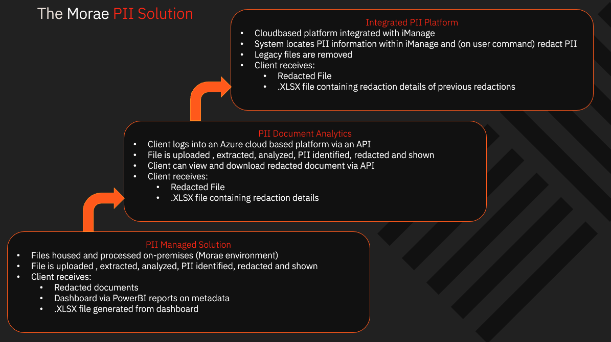

# Project Information

Details or description of the product that will improve the customer experience.

## Full Roadmap

## PII Document Analytics (POC)

For this proof of concept (POC) phase concessions were made by reducing complexities and placin the core focus on the redaction and NER recognition itself.

The POC has the ability to upload and automate the identification of PII entitites in a single PDF document. Also the user will be able to sof and hard redact the document using an authenticated cloud hosted session.

The POC will also give the users the ability to view and download redacted document as a pdf and entities as an excel file.
