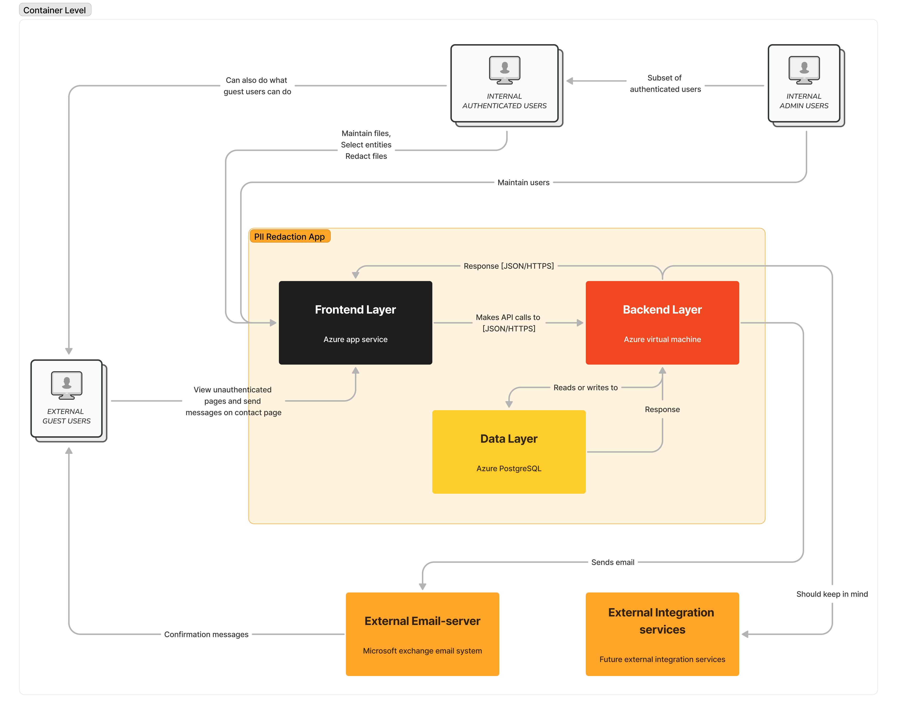

# Container level

The word "component" is a hugely overloaded term in the software development industry, but in this context a component is a grouping of related functionality encapsulated behind a well-defined interface. If you're using a language like Java or C#, the simplest way to think of a component is that it's a collection of implementation classes behind an interface. Aspects such as how those components are packaged (e.g. one component vs many components per JAR file, DLL, shared library, etc) is a separate and orthogonal concern.

An important point to note here is that all components inside a container typically execute in the same process space. In the C4 model, components are not separately deployable units.

## Back-end layer components

- Users
- Integrations
- Email server

## Front-end layer components

- Front-end Layer
- Back-end layer
- Data layer

## Data layer components

- Front-end Layer
- Back-end layer
- Data layer
