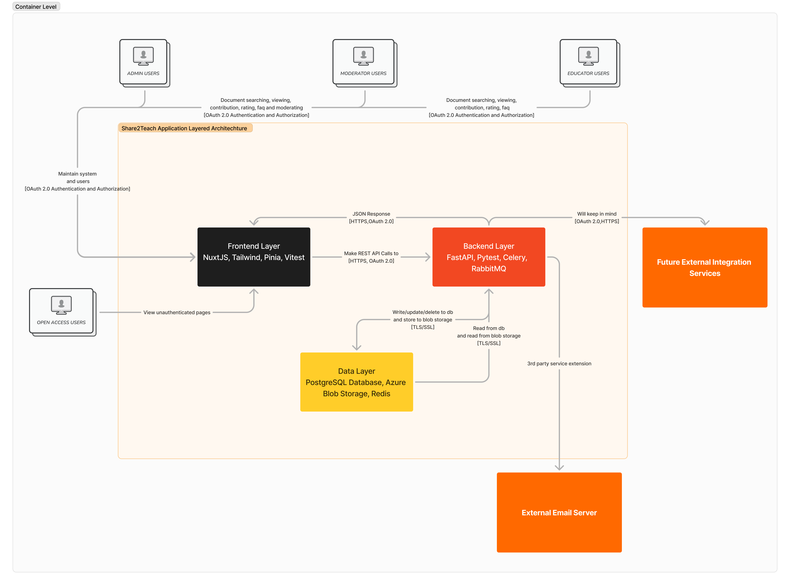

# Container level

In the C4 model, a container represents an application or a data store. A container is something that needs to be running in order for the overall software system to work. In real terms, a container is something like:

## External containers

- Users
- Integrations
- Email server

## Internal containers

- Front-end Layer
- Back-end layer
- Data layer
